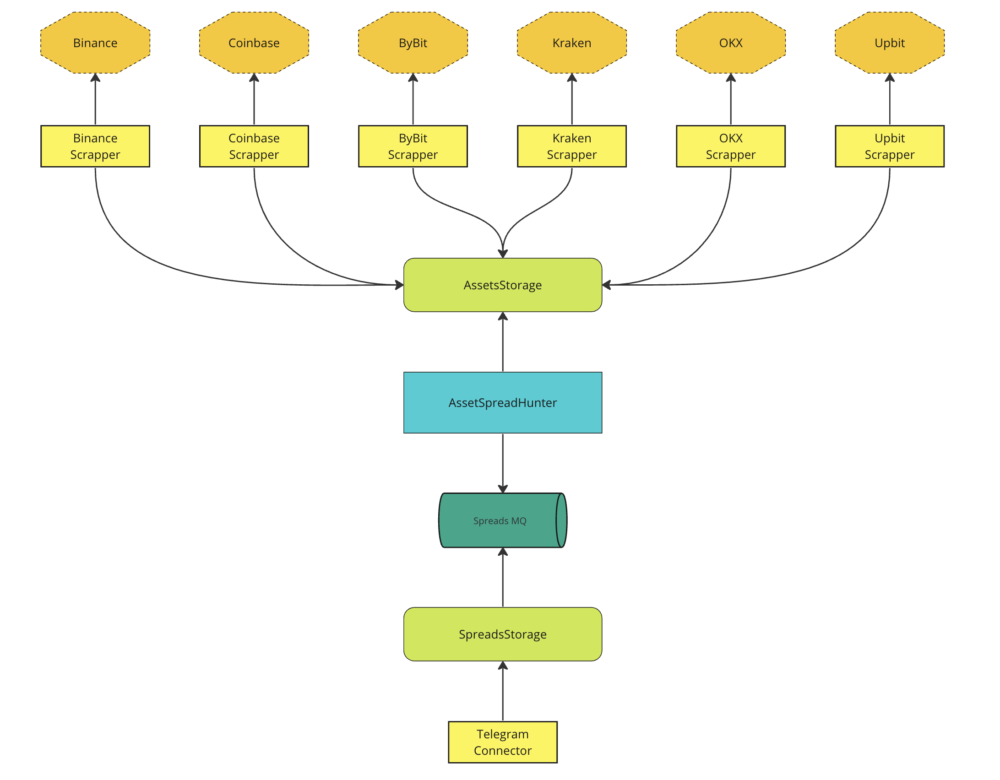

# HermesTrade

There are many online exchanges in the world that allow you to conduct transactions and buy financial assets over the Internet. 
Different exchanges are focused on different regions and have different liquidity. 
In addition, the demand for the same assets on different exchanges at one time may be different, so the cost may vary significantly. 

So, The project “**HermesTrade**” is aimed at creating an automated system that will analyze the value of various financial assets on different exchanges in real time 
and look for a sequence of transactions with which you can extract due to the difference in supply and demand on different exchanges.

## Features:

### Unique search algorithm

### High throughput

### Support for 6 exchanges

### Convenient and concise visualizer

## Project Architecture:

The architecture of the project consists of several related services divided by areas of responsibility.

In total, the project presents 5 types of services:

- Scrappers - collect information of currency pairs cost from one specific financial exchange
- AssetsStorage - deals  with the unification and pre-storage of currency pairs data.
- AssetSpreadHunter - performs the basic business logic of the project and analyzes financial assets and searches profitable spreads
- SpreadsStorage - responsible for storing spreads found all the time and providing them to external services
- Connectors - project services that provides found spreads for external sources(for example telegram bot)

The architecture is more clearly demonstrated in the diagram below:

## How to launch?

## How to contribute?

1. Create new branch from main: `git branch <YOUR_NICKNAME>:<FEATURE_NAME>`
2. Checkout to your branch: `git checkout <BRANCH_NAME_FROM_POINT_1>`
3. Write code
4. Write tests(__IMPORTANT__)
5. Test code on development environment
6. Create Pull Request
7. Wait for approve
