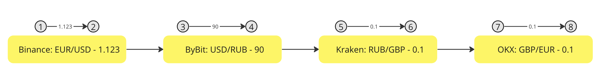
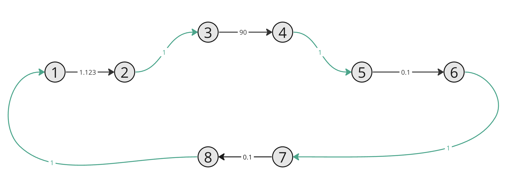
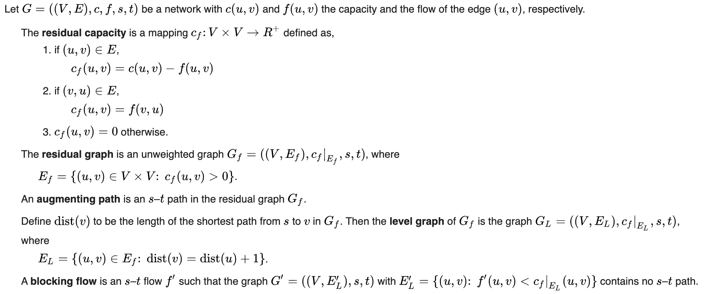

# Asset Spread Hunter Algorithm

This package presents an algorithm for finding profitable spreads from different exchanges.

This package describes the entire domain model and the entire set of necessary algorithms.

## How algorithm works?

The basic algorithm is based on two other graph algorithms such as the 
simple cycle search algorithm and 
the maximum flow search algorithm in the graph.
Further, the algorithm uses a variety of optimization methods and heuristics
that help improve the result or immediately cut off unprofitable strategies.

Let's look at the principle of operation in more detail:

### Part 1: Preparation

To prepare, we need to build a graph. 
To do this, we will group all assets by their universal identifier and draw edges between the pairs.

For example, we have 4 asset currency pairs:

We have marked all the vertices and drawn the edges with weights. 
A special function is calculated as a weight, which shows how profitable a particular transition can be.

After all the preparatory actions, we get graph:

Where the edges between different exchanges are marked in green and 
the edges between assets within the same exchange are marked in gray.

After constructing the graph, you can start executing the algorithm.

### Part 2: Searching for cycles

First you need to determine what will be considered a spread on the constructed graph?

It is easy to guess that **_spread is a cycle on a graph_** of non-zero length.

So next we need to find the maximum flow on this graph.
To do this, let's use the [Dinic's algorithm](https://en.wikipedia.org/wiki/Dinic's_algorithm).

The principle of operation of the algorithm is as follows:

After executing the algorithm, we can throw out the edges that are unnecessary for us and thus make the original complete graph more rare.

The next step is just to search for simple [loops](https://en.wikipedia.org/wiki/Loop_(graph_theory)).

The last part is to sort the found cycles by their profitability based on the settings received. 

### Part 3: Optimizations and heuristics

## What about algorithmic complexity?

## Real throughput and efficiency: